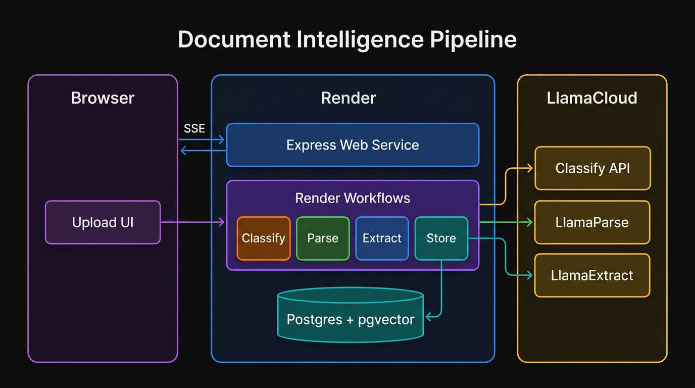
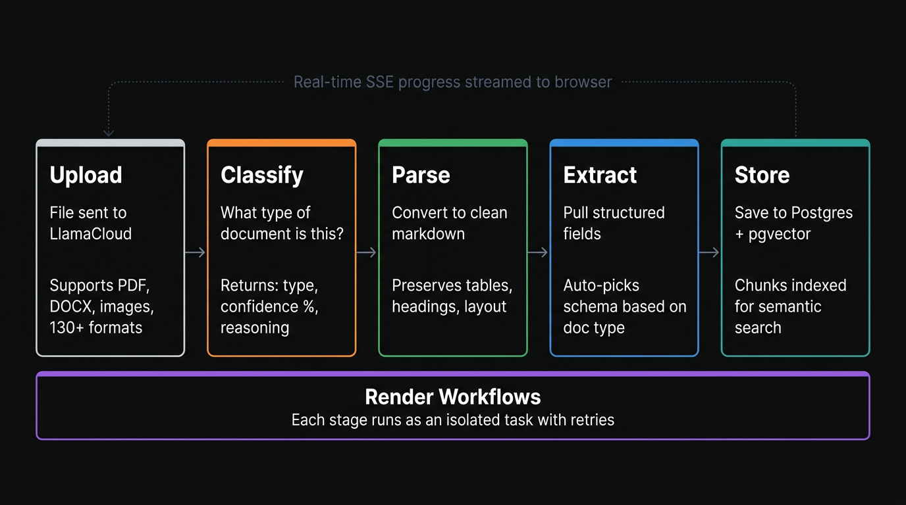

# Document Intelligence Pipeline

Upload PDFs and other documents. A Render Workflow runs LlamaCloud classify, parse, and extract, stores rows in Postgres, and optionally indexes into a LlamaCloud pipeline for search and RAG.

[](https://render.com/deploy?repo=https://github.com/ojusave/render-workflows-llamaindex)
[](https://discord.gg/gvC7ceS9YS)

## Table of contents

- [Highlights](#highlights)
- [Overview](#overview)
- [Prerequisites](#prerequisites)
- [Deploy to Render](#deploy-to-render)
- [Configuration](#configuration)
- [Usage](#usage)
- [How it works](#how-it-works)
- [Operations](#operations)
- [Project structure](#project-structure)
- [Extending](#extending)
- [Community](#community)
- [Troubleshooting](#troubleshooting)
- [Contributing](#contributing)
- [License](#license)

## Highlights

- **Thin web service, heavy workflow**: uploads and orchestration stay in Express; LlamaCloud work runs in separate workflow tasks with their own plans, timeouts, and retries ([Render Workflows](https://render.com/docs/workflows)).
- **Live progress**: the UI consumes Server-Sent Events so each pipeline stage shows up as it finishes.
- **Optional semantic search**: set `LLAMACLOUD_PIPELINE_ID` for managed indexing plus Search and Ask with citations ([LlamaCloud](https://cloud.llamaindex.ai)).
- **Blueprint-friendly**: [`render.yaml`](render.yaml) stands up the web service and Postgres; you add the workflow service in the dashboard (workflows are not Blueprint-created).

## Overview

The app is a reference layout for document AI on Render: multipart uploads and URL downloads land on disk, then the web service dispatches tasks for LlamaCloud Files, classification, agentic parse, structured extract, and Postgres plus pipeline storage. Nothing in that chain blocks the HTTP thread except streaming status back to the client.

Who it is for: teams already on Render who want a working LlamaCloud integration and a clear place to add document types and schemas.

## Prerequisites

- A [Render account](https://render.com/register?utm_source=github&utm_medium=referral&utm_campaign=ojus_demos&utm_content=hero_cta) (free tier works for the database; the web service needs at least Starter)
- A [LlamaCloud account](https://cloud.llamaindex.ai) and API key ([pricing](https://cloud.llamaindex.ai/pricing): agentic tier uses credits per page)
- A [Render API key](https://render.com/docs/api#1-create-an-api-key)
- Optional: a [LlamaCloud pipeline](https://cloud.llamaindex.ai) for semantic search (Index > Create Pipeline in the LlamaCloud UI)

## Deploy to Render

Installation for this repo is deployment on Render: there is no separate “run locally” path documented here.

### 1. Web service + database (via Blueprint)

Click **Deploy to Render** above or create a [Blueprint](https://render.com/docs/infrastructure-as-code) from this repo. [`render.yaml`](render.yaml) creates a web service and a Postgres database with automatic connection string injection.

You will be prompted for `RENDER_API_KEY` and `LLAMA_CLOUD_API_KEY`.

### 2. Workflow service (manual)

1. [Render Dashboard](https://dashboard.render.com) > New > Workflow
2. Connect this repository
3. Build: `npm install && npm run build`
4. Start: `node dist/tasks/index.js`
5. Name: `render-workflows-llamaindex-workflow` (must match `WORKFLOW_SLUG`)
6. Env vars: `LLAMA_CLOUD_API_KEY`, `LLAMACLOUD_PIPELINE_ID`, `DATABASE_URL` ([Internal URL](https://render.com/docs/databases#connecting-from-within-render))

### 3. Enable search (optional)

Create a pipeline in the [LlamaCloud UI](https://cloud.llamaindex.ai) (Index > Create Pipeline). Copy the pipeline ID and set `LLAMACLOUD_PIPELINE_ID` on both the web service and workflow service. Uploaded documents are indexed automatically, and **Ask** and **Search** use LlamaCloud retrieval with embeddings and reranking.

## Configuration

| Variable | Where | Default | Description |
|---|---|---|---|
| `RENDER_API_KEY` | Web service | (required) | [Render API key](https://render.com/docs/api#1-create-an-api-key) for dispatching workflow tasks |
| `LLAMA_CLOUD_API_KEY` | Both | (required) | [LlamaCloud API key](https://cloud.llamaindex.ai) |
| `DATABASE_URL` | Both | (required) | Postgres [Internal URL](https://render.com/docs/databases#connecting-from-within-render). Auto-injected on web service via Blueprint. |
| `LLAMACLOUD_PIPELINE_ID` | Both | (optional) | [LlamaCloud pipeline](https://cloud.llamaindex.ai) ID for semantic search and RAG |
| `WORKFLOW_SLUG` | Web service | `render-workflows-llamaindex-workflow` | Must match the workflow service name |
| `MAX_UPLOAD_BYTES` | Web service | `104857600` (100 MB) | Max file size for uploads, URL downloads, and bytes sent to the first workflow task (lower if dispatch payload limits apply) |
| `PORT` | Web service | `3000` | [Set automatically by Render](https://render.com/docs/environment-variables#all-runtimes) |

## Usage

After deploy, open the web service URL from the Render Dashboard. You can upload a file or paste a document URL, watch the activity stream, then use **Search** or **Ask** if a pipeline ID is configured. Document history appears in the **Documents** list backed by Postgres.

## How it works



The web service accepts file uploads (or URLs), reads bytes from disk, and dispatches five [workflow tasks](https://render.com/docs/workflows-defining): upload to LlamaCloud, then classify, parse, extract, and store. Each stage has its own compute plan, retries, and timeout. Processed documents can be indexed in a [LlamaCloud managed pipeline](https://developers.llamaindex.ai/cloud-api-reference/llama-platform/) for semantic search with embeddings, hybrid retrieval, and reranking.



## Operations

**Health check**: `GET /health` returns `{"status":"ok"}`.

**Logs**: web service and workflow task logs in the [Render Dashboard](https://dashboard.render.com).

## Project structure

```
main.ts                      Express web server: upload, search, ask, documents
pipeline/orchestrator.ts     Dispatch tasks, poll, stream SSE
tasks/
  index.ts                   Workflow entry point
  upload.ts                  LlamaCloud Files API (register upload)
  classify.ts                LlamaCloud Classify API
  parse.ts                   LlamaParse agentic tier
  extract.ts                 LlamaExtract with auto-schema
  schemas.ts                 JSON Schemas per document type
  store.ts                   Postgres writes + LlamaCloud pipeline indexing
shared/
  db.ts                      Postgres pool, schema init, queries
  llama-client.ts            Shared LlamaCloud client singleton
  pipeline-retrieval.ts      Search/Ask: MANAGED vs PLAYGROUND retrieval APIs
static/index.html            Frontend UI
render.yaml                  Render Blueprint
```

## Extending

**Add a document type**: add a rule to [`tasks/classify.ts`](tasks/classify.ts) and a matching schema to [`tasks/schemas.ts`](tasks/schemas.ts). The extract task picks the schema automatically.

## Community

Questions about Render, workflows, or troubleshooting a deploy: join the [Render Developers Discord](https://discord.gg/gvC7ceS9YS).

## Troubleshooting

**Workflow tasks fail immediately**: `WORKFLOW_SLUG` on the web service must match the workflow service name exactly.

**Database connection errors**: use the [Internal URL](https://render.com/docs/databases#connecting-from-within-render), not the External URL.

**Search returns "not configured"**: set `LLAMACLOUD_PIPELINE_ID` on both web service and workflow service.

**Search / Ask and pipeline types**: LlamaCloud distinguishes **MANAGED** and **PLAYGROUND** pipelines. The UI often creates **PLAYGROUND** pipelines. The app uses `pipelines.retrieve` for MANAGED and `retrievers.search` for PLAYGROUND so both work with the same `LLAMACLOUD_PIPELINE_ID`.

**Download or upload "too large"**: defaults allow **100 MB** per file. Set `MAX_UPLOAD_BYTES` on the web service (and keep the same value for predictable behavior) if you need a different cap. Very large files increase memory use because the first workflow task receives base64-encoded bytes.

**`Unsupported file type: None` (LlamaCloud)**: the upload task must write a file with a real extension (for example `.pdf`, not `.bin`). The workflow infers an extension from the filename, `Content-Type` (URL downloads), or a few magic-byte signatures. Prefer uploading files whose names include an extension.

**LlamaCloud rate limits**: tasks retry automatically (2 retries with exponential backoff). Check your [usage dashboard](https://cloud.llamaindex.ai).

## Contributing

See [CONTRIBUTING.md](CONTRIBUTING.md) for issues, pull requests, and how to validate changes.

## License

[MIT](LICENSE). Copyright (c) 2026 Ojusave.
