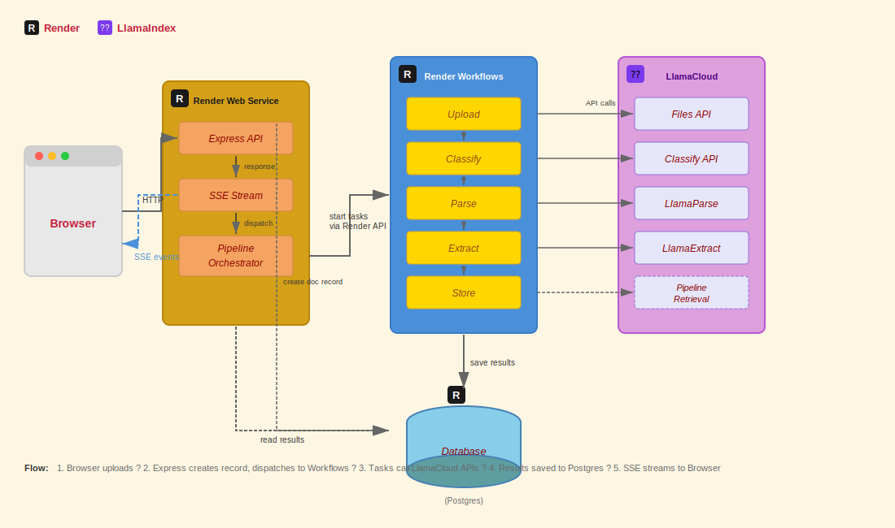

<div align="center">

# Document Intelligence Pipeline

A production-ready document AI pipeline combining **Render Workflows** for orchestration and **LlamaCloud** for intelligent document processing. Upload any document and watch it get classified, parsed, and structured in real-time.

<p>
  <a href="https://render.com/deploy?repo=https://github.com/ojusave/render-workflows-llamaindex">
    
  </a>
</p>

<p>
  <a href="https://render.com">
    
  </a>
  <a href="https://cloud.llamaindex.ai">
    
  </a>
  <a href="https://discord.gg/gvC7ceS9YS">
    
  </a>
  <a href="https://discord.com/invite/dGcwcsnxhU">
    
  </a>
</p>

</div>

## What This Demo Shows

This repo demonstrates how to build document AI applications using:

| Platform | Role |
| --- | --- |
| **[Render Workflows](https://render.com/docs/workflows)** | Orchestrates long-running document processing tasks with automatic retries, timeouts, and monitoring |
| **[LlamaCloud](https://cloud.llamaindex.ai)** | Provides the AI-powered document intelligence: classification, parsing, and structured extraction |
| **[Render Postgres](https://render.com/docs/databases)** | Stores processed documents and extracted data |
| **[Render Web Services](https://render.com/docs/web-services)** | Hosts the Express API and serves the real-time UI |

## Architecture



### How It Works

1. **Browser** uploads a document to the **Express API** on Render
2. **Express** streams progress via SSE and dispatches work to **Render Workflows**
3. **Render Workflows** executes five tasks, each calling a **LlamaCloud API**:

| Render Workflow Task | LlamaCloud API | What It Does |
| --- | --- | --- |
| `upload_to_llamacloud` | [Files API](https://docs.cloud.llamaindex.ai/llamacloud/api/files) | Registers the document and returns a `file_id` |
| `classify_document` | [Classify API](https://docs.cloud.llamaindex.ai/llamacloud/api/classify) | Identifies document type (invoice, contract, form, etc.) |
| `parse_document` | [LlamaParse](https://docs.cloud.llamaindex.ai/llamaparse/getting_started) | Extracts clean markdown and text from 130+ file formats |
| `extract_fields` | [LlamaExtract](https://docs.cloud.llamaindex.ai/llamacloud/api/extract) | Pulls structured fields based on document type |
| `store_results` | — | Saves everything to Render Postgres |

4. Results stream back to the browser in real-time

## Quick Start

### Prerequisites

- [Render account](https://render.com/register) (free tier works)
- [LlamaCloud account](https://cloud.llamaindex.ai) (free tier available)

### Deploy

1. Click **Deploy to Render** above
2. You'll be prompted for:
   - `RENDER_API_KEY` — [Get one here](https://render.com/docs/api#1-create-an-api-key)
   - `LLAMA_CLOUD_API_KEY` — [Get one here](https://cloud.llamaindex.ai)

3. Create the Workflow service manually:
   - Go to [Render Dashboard](https://dashboard.render.com) → **New** → **Workflow**
   - Connect this repository
   - Build command: `npm install && npm run build`
   - Start command: `node dist/tasks/index.js`
   - Name: `render-workflows-llamaindex-workflow`
   - Add env vars: `LLAMA_CLOUD_API_KEY`, `DATABASE_URL` (from your Postgres)

4. Open your web service URL and upload a document!

## Features

| Feature | Description |
| --- | --- |
| **Real-time progress** | Watch each pipeline stage complete via Server-Sent Events |
| **130+ file formats** | LlamaParse handles PDF, DOCX, XLSX, images, HTML, and more |
| **Smart classification** | LlamaCloud Classify identifies document types automatically |
| **Structured extraction** | LlamaExtract pulls typed fields based on document type |
| **Ephemeral sessions** | Each user gets isolated data that auto-deletes (configurable) |
| **Optional search** | Enable semantic search with a LlamaCloud pipeline |

## Configuration

| Variable | Where | Description |
| --- | --- | --- |
| `RENDER_API_KEY` | Web service | [Render API key](https://render.com/docs/api#1-create-an-api-key) for dispatching workflow tasks |
| `LLAMA_CLOUD_API_KEY` | Both services | [LlamaCloud API key](https://cloud.llamaindex.ai) for document AI |
| `DATABASE_URL` | Both services | Render Postgres connection string |
| `LLAMACLOUD_PIPELINE_ID` | Both (optional) | Enable [semantic search](https://docs.cloud.llamaindex.ai/llamacloud/guides/pipelines) |
| `SESSION_LIFETIME_MINUTES` | Web service | Session duration before cleanup (default: 15) |

## Privacy & Demo Mode

> [!WARNING]
> **For public demos**: This app includes a prominent warning against uploading sensitive documents. Session data is deleted from Postgres on expiry, but if `LLAMACLOUD_PIPELINE_ID` is set, indexed text persists in LlamaCloud.

To run as a privacy-safe demo:
- Leave `LLAMACLOUD_PIPELINE_ID` empty (disables Search/Ask, but classify/parse/extract still work)
- Or create a LlamaCloud pipeline you periodically clear

## Project Structure

```
main.ts                      Express API + SSE streaming
pipeline/orchestrator.ts     Dispatches Render Workflow tasks
tasks/
  upload.ts                  → LlamaCloud Files API
  classify.ts                → LlamaCloud Classify API
  parse.ts                   → LlamaParse
  extract.ts                 → LlamaExtract
  store.ts                   → Render Postgres
shared/
  db.ts                      Postgres queries
  llama-client.ts            LlamaCloud SDK client
render.yaml                  Render Blueprint
```

## API Routes

All document routes are session-scoped under `/s/{token}/`.

| Method | Path | Description |
| --- | --- | --- |
| `GET` | `/` | Creates session, redirects to `/s/{token}` |
| `POST` | `/s/{token}/upload` | Upload file, returns SSE progress stream |
| `POST` | `/s/{token}/upload-url` | Fetch from URL, returns SSE progress stream |
| `GET` | `/s/{token}/documents` | List documents in session |
| `POST` | `/s/{token}/search` | Semantic search (requires `LLAMACLOUD_PIPELINE_ID`) |
| `POST` | `/s/{token}/ask` | RAG retrieval (requires `LLAMACLOUD_PIPELINE_ID`) |

## Troubleshooting

| Problem | Solution |
| --- | --- |
| Workflow tasks fail immediately | Ensure `WORKFLOW_SLUG` matches your workflow service name exactly |
| Database connection errors | Use the Postgres **Internal URL**, not External |
| Search returns "not configured" | Set `LLAMACLOUD_PIPELINE_ID` on both services |
| "Unsupported file type" | Ensure filename has a valid extension (`.pdf`, `.docx`, etc.) |
| LlamaCloud rate limits | Tasks retry automatically; check your [LlamaCloud dashboard](https://cloud.llamaindex.ai) |

## Learn More

**Render:**
- [Render Workflows Documentation](https://render.com/docs/workflows)
- [Render Developers Discord](https://discord.gg/gvC7ceS9YS)

**LlamaIndex:**
- [LlamaCloud Documentation](https://docs.cloud.llamaindex.ai)
- [LlamaParse Documentation](https://docs.cloud.llamaindex.ai/llamaparse/getting_started)
- [LlamaIndex Discord](https://discord.com/invite/dGcwcsnxhU)

## License

[MIT](LICENSE)
