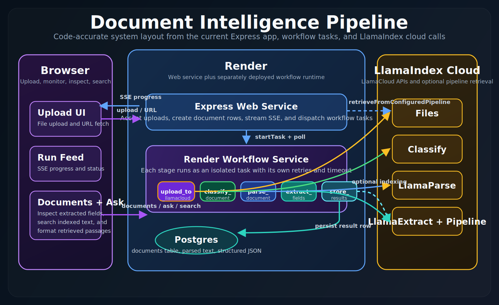
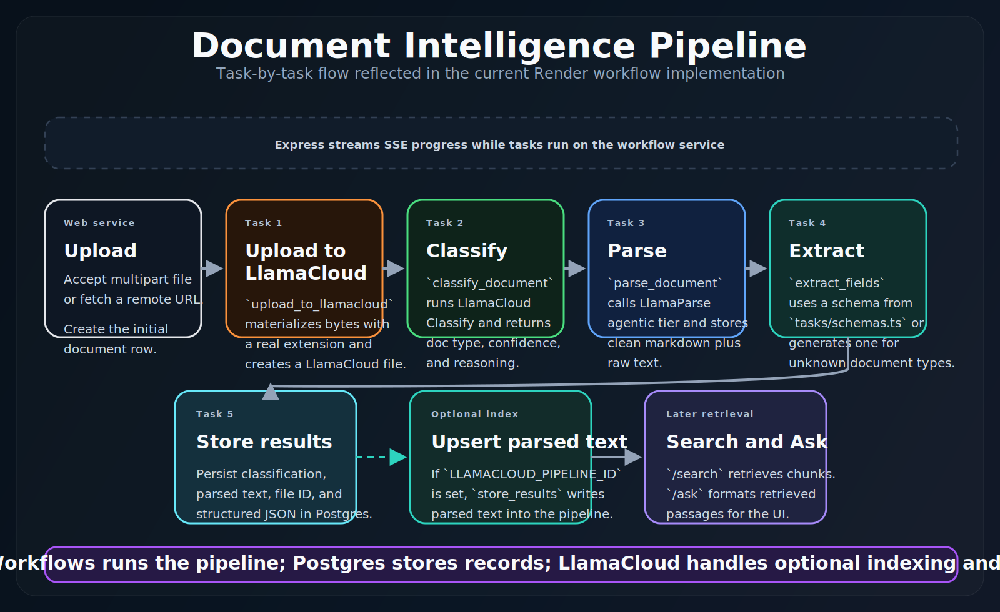

<div align="center">

# Document Intelligence Pipeline

Render Workflows is the center of this document pipeline. A thin Express service handles uploads and live progress, while workflow tasks call LlamaIndex-powered LlamaCloud APIs, store results in Postgres, and can optionally index parsed text for search and Ask.

<p>
  <a href="https://render.com/deploy?repo=https://github.com/ojusave/render-workflows-llamaindex">
    
  </a>
  <a href="https://discord.gg/gvC7ceS9YS">
    
  </a>
</p>

<p>
  <strong>Render Workflows</strong> · <strong>LlamaIndex / LlamaCloud</strong> · <strong>Postgres</strong> · <strong>Optional Search / Ask</strong>
</p>

</div>

## Why this example exists

This repo is a Render Workflows-first reference layout for document AI on Render:

- uploads and URL downloads land in a lightweight Express web service
- heavy LlamaIndex cloud work runs in separate Render Workflow tasks
- extracted rows are stored in Postgres
- indexed search and Ask are enabled when `LLAMACLOUD_PIPELINE_ID` is set

It is a good fit for teams already on Render who want a working LlamaCloud integration and a clear place to extend document types, schemas, and retrieval behavior.

## What you get

| Capability | What it means |
| --- | --- |
| Render Workflows at the center | The HTTP tier accepts uploads and streams status while Render Workflows handles the expensive classify, parse, extract, and store steps. |
| Live progress | The UI consumes Server-Sent Events so each pipeline stage appears as it finishes. |
| Optional semantic retrieval | Set `LLAMACLOUD_PIPELINE_ID` to enable Search and Ask with LlamaCloud retrieval. |
| Blueprint-friendly | [`render.yaml`](render.yaml) creates the web service and Postgres database. The workflow service is created manually in the Render dashboard. |

## Architecture

These diagrams match the current code paths in [`main.ts`](main.ts), [`pipeline/orchestrator.ts`](pipeline/orchestrator.ts), and [`tasks/`](tasks).

### System layout



### Pipeline flow



The web service accepts file uploads or URLs, reads bytes from disk, and dispatches five [workflow tasks](https://render.com/docs/workflows-defining). Nothing in that chain blocks the HTTP thread beyond streaming status updates back to the browser.

### Workflow stages

| Stage | Service | Output |
| --- | --- | --- |
| Upload | LlamaCloud Files | Registers the uploaded file and returns a `file_id` |
| Classify | LlamaCloud Classify | Resolves document type and confidence |
| Parse | LlamaParse agentic tier | Produces clean markdown and raw text |
| Extract | LlamaExtract | Produces structured fields from the classified schema |
| Store | Postgres + optional LlamaCloud pipeline | Persists document rows and optionally indexes parsed text for retrieval |

## Deploy to Render

### 1. Web service and database via Blueprint

Click **Deploy to Render** above, or create a [Blueprint](https://render.com/docs/infrastructure-as-code) from this repository. [`render.yaml`](render.yaml) provisions:

- a web service
- a Postgres database
- automatic `DATABASE_URL` injection into the web service

You will be prompted for:

- `RENDER_API_KEY`
- `LLAMA_CLOUD_API_KEY`

### 2. Workflow service in the Render dashboard

1. Open [Render Dashboard](https://dashboard.render.com) -> **New** -> **Workflow**
2. Connect this repository
3. Set build command to:

   ```bash
   npm install && npm run build
   ```

4. Set start command to:

   ```bash
   node dist/tasks/index.js
   ```

5. Name the service `render-workflows-llamaindex-workflow`
6. Add these environment variables:
   - `LLAMA_CLOUD_API_KEY`
   - `LLAMACLOUD_PIPELINE_ID`
   - `DATABASE_URL` using the Postgres [Internal URL](https://render.com/docs/databases#connecting-from-within-render)

> [!IMPORTANT]
> The workflow service name must exactly match `WORKFLOW_SLUG`.

### 3. Enable semantic search and Ask (optional)

Create a pipeline in the [LlamaCloud UI](https://cloud.llamaindex.ai) at **Index -> Create Pipeline**. Copy the pipeline ID and set `LLAMACLOUD_PIPELINE_ID` on both the web service and the workflow service.

When this value is present:

- uploaded documents are indexed automatically
- **Search** uses LlamaCloud retrieval
- **Ask** returns retrieved passages formatted for the UI

## Configuration

| Variable | Where | Default | Description |
| --- | --- | --- | --- |
| `RENDER_API_KEY` | Web service | required | [Render API key](https://render.com/docs/api#1-create-an-api-key) used to dispatch workflow tasks |
| `LLAMA_CLOUD_API_KEY` | Both | required | [LlamaCloud API key](https://cloud.llamaindex.ai) |
| `DATABASE_URL` | Both | required | Postgres [Internal URL](https://render.com/docs/databases#connecting-from-within-render). Auto-injected on the web service by the Blueprint. |
| `LLAMACLOUD_PIPELINE_ID` | Both | optional | [LlamaCloud pipeline](https://cloud.llamaindex.ai) ID for semantic search and Ask retrieval |
| `WORKFLOW_SLUG` | Web service | `render-workflows-llamaindex-workflow` | Must match the workflow service name exactly |
| `MAX_UPLOAD_BYTES` | Web service | `104857600` | Max file size in bytes for uploads, URL downloads, and the first workflow dispatch payload |
| `DOCUMENT_RETENTION_MINUTES` | Web service | `10` | Delete `documents` rows older than this many minutes. Set `0` to keep all rows. |
| `DOCUMENT_PURGE_INTERVAL_MS` | Web service | `60000` | How often the web process runs retention cleanup |
| `PORT` | Web service | `3000` | [Set automatically by Render](https://render.com/docs/environment-variables#all-runtimes) |

## Use it after deploy

1. Open the web service URL from the Render dashboard.
2. Upload a file or paste a document URL.
3. Watch the activity stream as each pipeline stage completes.
4. Open the **Documents** list to inspect parsed content and structured output.
5. If `LLAMACLOUD_PIPELINE_ID` is configured, use **Search** and **Ask** against indexed documents.

> [!TIP]
> `Ask` currently retrieves and formats relevant passages from the LlamaCloud pipeline. It does not call a separate answer-generation model yet.

## HTTP surface

| Method | Path | Body | Response |
| --- | --- | --- | --- |
| `GET` | `/health` | - | `{ "status": "ok" }` |
| `GET` | `/` | - | Static UI |
| `POST` | `/upload` | multipart file | SSE pipeline |
| `POST` | `/upload-url` | `{ "url" }` | SSE pipeline |
| `GET` | `/documents` | - | JSON list |
| `GET` | `/documents/:id` | - | JSON or `404` |
| `DELETE` | `/documents/:id` | - | `{ "status": "ok" }` or `404` |
| `POST` | `/search` | `{ "query" }` | JSON results, requires `LLAMACLOUD_PIPELINE_ID` |
| `POST` | `/ask` | `{ "question" }` | JSON answer plus passages, requires `LLAMACLOUD_PIPELINE_ID` |

## Monorepo note

If this folder lives inside a monorepo such as **Samples**, use the repository root [`render.yaml`](../render.yaml) for preview environments and multi-service deploys. This folder's [`render.yaml`](render.yaml) is for standalone clones.

## Project structure

```text
main.ts                      Express web server: upload, search, ask, documents
pipeline/orchestrator.ts     Dispatch tasks, poll, stream SSE
tasks/
  index.ts                   Workflow entry point
  upload.ts                  LlamaCloud Files API (register upload)
  classify.ts                LlamaCloud Classify API
  parse.ts                   LlamaParse agentic tier
  extract.ts                 LlamaExtract with auto-schema
  schemas.ts                 JSON Schemas per document type
  store.ts                   Postgres writes + LlamaCloud pipeline indexing
shared/
  db.ts                      Postgres pool, schema init, queries
  llama-client.ts            Shared LlamaCloud client singleton
  pipeline-retrieval.ts      Search and Ask retrieval adapters
static/index.html            Frontend UI
render.yaml                  Render Blueprint
```

## Troubleshooting

**Workflow tasks fail immediately**  
`WORKFLOW_SLUG` on the web service must exactly match the workflow service name.

**Database connection errors**  
Use the Postgres [Internal URL](https://render.com/docs/databases#connecting-from-within-render), not the External URL.

**Search returns "not configured"**  
Set `LLAMACLOUD_PIPELINE_ID` on both the web service and the workflow service.

**Search and Ask behave differently across pipeline types**  
LlamaCloud distinguishes **MANAGED** and **PLAYGROUND** pipelines. The app uses `pipelines.retrieve` for managed pipelines and `retrievers.search` for playground pipelines so both work with the same `LLAMACLOUD_PIPELINE_ID`.

**Download or upload is "too large"**  
The default max is **100 MB** per file. Increase `MAX_UPLOAD_BYTES` if needed, but remember that the first workflow task receives base64-encoded bytes, so very large files increase memory use.

**`Unsupported file type: None` from LlamaCloud**  
The upload task must write a file with a real extension such as `.pdf`, not `.bin`. The workflow infers extensions from the filename, `Content-Type`, or a few magic-byte signatures.

**LlamaCloud rate limits**  
Tasks retry automatically with exponential backoff. Check your [usage dashboard](https://cloud.llamaindex.ai) if you keep seeing retries or failures.

## Contributing

Open an issue or a focused PR. If you add a document type:

1. add a classification rule in [`tasks/classify.ts`](tasks/classify.ts)
2. add the matching JSON schema in [`tasks/schemas.ts`](tasks/schemas.ts)

The extract task selects the schema from the classified type.

Before pushing changes, run:

```bash
npm install && npm run build
```

## Community

Questions about Render, workflows, or deployment troubleshooting: join the [Render Developers Discord](https://discord.gg/gvC7ceS9YS).

## License

[MIT](LICENSE). Copyright (c) 2026 Ojusave.
